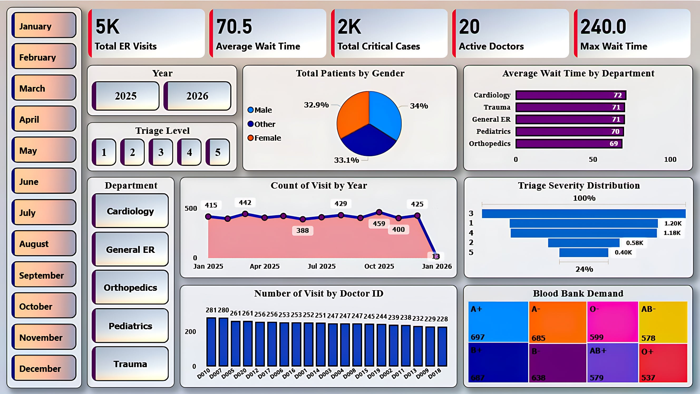

# 🚑 Hospital Emergency Response Analytics & Data Engineering Pipeline


> **Architecting a secure, end-to-end data pipeline to process historical medical records and simulate real-time Emergency Response (ER) vitals using Python, Snowflake, and Power BI.**

---

## 📌 Table of Contents
- [Overview](#overview)
- [Business Problem](#business-problem)
- [Dataset](#dataset)
- [Tools & Technologies](#tools--technologies)
- [Project Structure](#project-structure)
- [Data Processing & Security](#data-processing--security)
- [Advanced SQL Analytics](#advanced-sql-analytics)
- [Key Findings & Business Impact](#key-findings--business-impact)
- [Dashboard](#dashboard)
- [Architecture](#architecture)
- [How to Run This Project](#how-to-run-this-project)
- [Results & Conclusion](#results--conclusion)
- [Final Recommendations](#final-recommendations)
- [Future Work](#future-work)
- [Author & Contact](#author--contact)

---

<h2 id="overview">📖 Overview</h2>

This project is a comprehensive Data Engineering and Business Intelligence solution designed to optimize **Hospital Emergency Response** operations. A robust pipeline was built using Python and PySpark for data processing, Snowflake for secure cloud data warehousing, and Power BI to visualize critical metrics such as response times, triage severity, and physician workload during critical incidents.

---

<h2 id="business-problem">🎯 Business Problem</h2>

Hospital administrators and dispatch teams need real-time visibility into Emergency Response operations to ensure rapid patient care and allocate medical staff efficiently. This project aims to:
* **Identify bottlenecks** causing prolonged patient wait and response times.
* **Track physician bandwidth** to prevent burnout and optimize staffing.
* **Filter and prioritize** critical life-threatening cases (Triage Levels 1 & 2) for immediate action.
* **Enforce strict healthcare data compliance (HIPAA)** by masking sensitive PII/PHI data from unauthorized personnel.

---

<h2 id="dataset">🗂️ Dataset</h2>

* **Raw Data:** Sourced via local CSV files (`patients_data.csv`, `er_visits_data.csv`) stored in the `/data/` directory.
* **Processed Data:** Cleaned output datasets (`processed_data.csv`) generated via PySpark batch processing.

---

<h2 id="tools--technologies">🛠️ Tools & Technologies</h2>

| Category | Tools & Technologies Used |
| :--- | :--- |
| **Data Processing & Streaming** | Python, Apache PySpark |
| **Cloud Data Warehouse** | Snowflake (Standard Edition) |
| **Data Governance & Security**| Role-Based Access Control (RBAC), Secure Views, Dynamic Masking |
| **Business Intelligence** | Power BI (Import Mode, Custom DAX modeling) |
| **Version Control & Design** | Git, GitHub, Draw.io / Eraser.io |

---

<h2 id="project-structure">📂 Project Structure</h2>

```text
Hospital-ER-Analytics-Python-Snowflake-PowerBI/
│
├── README.md                       # Main project documentation and findings
├── .gitignore                      # Git ignore file
│
├── data/                           # Raw and processed datasets
│   ├── patients_data.csv
│   ├── er_visits_data.csv
│   └── processed_data.csv
│
├── scripts/                        # Python & PySpark scripts for processing and streaming
│   ├── hospital_data.py
│   ├── pyspark_batch_processing.py
│   └── python_stream_processing.py
│
├── sql/                            # Snowflake SQL scripts for analytics and governance
│   ├── 01_Hospital_Data.sql
│   ├── 02_Advanced_Queries.sql
│   ├── 03_Implement_Security.sql
│   ├── 04_Data_Optimization.sql
│   └── 05_Performance_Tuning.sql
│
├── dashboard/                      # Power BI dashboard file
│   └── Hospital_ER_Dashboard.pbix
│
├── images/                         # Architecture diagrams and dashboard screenshots
│   ├── architecture_diagram.png
│   └── dashboard.jpg

```

---

<h2 id="data-processing--security">🔒 Data Processing & Security</h2>

* **Real-Time Simulation:** Built a Python message broker to simulate live streaming of patient vitals during emergency responses, instantly flagging critical heart rates.
* **Batch Processing:** Utilized PySpark to clean and merge historical patient demographics with emergency response logs.
* **Enterprise Security:** Implemented Snowflake Secure Views and Dynamic Data Masking to hide sensitive medical conditions based on user roles (Admin vs. Analyst).
* **Performance Tuning:** Applied Snowflake clustering keys and optimized virtual warehouse scaling for faster query execution during high-volume data loads.

---

<h2 id="advanced-sql-analytics">⚡ Advanced SQL Analytics</h2>

**Complex Query Execution:**

* Deployed **Common Table Expressions (CTEs)** to isolate the most severe emergency response incidents.
* Utilized **Window Functions** to calculate rolling averages for response and wait times across different hospital wings.
* Mapped individual `DOCTOR_ID`s to incident counts to visualize exact workload distribution during emergency situations.

---

<h2 id="key-findings--business-impact">📈 Key Findings & Business Impact</h2>

1. **Wait Time Bottlenecks:** The average ER wait time sits at **70.5 minutes**, with Cardiology and Trauma experiencing the highest average delays (71-72 mins). Furthermore, the Maximum Wait Time hit an alarming **240 minutes**, indicating severe outlier bottlenecks that require immediate administrative review.
2. **Critical Patient Load:** Successfully filtered and prioritized **2,000 critical cases** (Triage Levels 1 & 2), ensuring life-threatening emergencies are separated from minor incidents.
3. **Physician Workload:** Visualized workload across 20 active doctors, revealing an uneven distribution of patient visits (ranging from highs of ~281 visits down to ~228), highlighting an opportunity to rebalance physician shift scheduling.
4. **Blood Bank Demand Management:** Tracked patient blood groups via a proportional Treemap to give hospital inventory managers real-time insights into the highest-demand blood types (A+ and A-) flowing through the ER.

---

<h2 id="dashboard">📊 Dashboard</h2>

* **Power BI Dashboard Features:**
* Executive KPI Cards (Total ER Visits, Average & Max Wait Times, Active Doctors, Critical Cases via DAX).
* Interactive Slicers for Time Intelligence (Month/Year), Triage Level, and Department Routing.
* Triage Severity Funnel and Patient Gender Demographics.
* Blood Bank Demand Treemap utilizing dimensional patient data.



---

<h2 id="architecture">🏗️ Architecture</h2>


---

<h2 id="how-to-run-this-project">⚙️ How to Run This Project</h2>

**1. Clone the repository:**

```bash
git clone [https://github.com/Swayanshu-Jena/Hospital-ER-Analytics-Python-Snowflake-PowerBI.git](https://github.com/Swayanshu-Jena/Hospital-ER-Analytics-Python-Snowflake-PowerBI.git)

```

**2. Run the data processing scripts:**

```bash
python scripts/pyspark_batch_processing.py
python scripts/python_stream_processing.py

```

**3. Execute Snowflake SQL in sequence:**

* Open your Snowflake worksheet.
* Run the SQL files in `sql/` sequentially from `01_Hospital_Data.sql` to `05_Performance_Tuning.sql` to build the tables, analyze the response data, and set up role-based security.

**4. Launch the BI Dashboard:**

* Open `dashboard/Hospital_ER_Dashboard.pbix` in Power BI Desktop to interact with the visualizations.

---

<h2 id="results--conclusion">✅ Results & Conclusion</h2>

The project successfully established a highly scalable, secure data pipeline that bridges the gap between raw medical logs and actionable administrative insights. By leveraging Snowflake's robust governance features and Power BI's dynamic DAX modeling, hospital administrators can now monitor ER operations with zero compromise on patient data privacy (simulating real-world HIPAA compliance). The analysis proved that tracking specific operational metrics—like physician bandwidth and department-specific wait times—can directly pinpoint where administrative action is needed to save lives.

---

<h2 id="final-recommendations">💡 Final Recommendations (Business)</h2>

* **Dynamic Staffing Models:** Reallocate nursing and physician staff based on historical peak times identified in the dashboard to anticipate seasonal or daily patient volume spikes.
* **Automated Triage Alerts:** Implement real-time pager or dashboard alerts for Triage Level 1 and 2 patients whose wait times exceed a critical 15-minute threshold.
* **Strategic Blood Bank Routing:** Use the Blood Bank Demand metrics to trigger automated inventory requests from external blood banks during high-trauma events, ensuring zero shortages for A+ and A- blood types.

---

<h2 id="future-work">🚀 Future Work (Technical)</h2>

* **True Real-Time Streaming:** Upgrade the Python simulation to a production-grade Apache Kafka or AWS Kinesis stream for millisecond-latency data ingestion.
* **Predictive Machine Learning:** Implement Python-based predictive modeling (e.g., XGBoost) to forecast ER patient volumes and wait times 24-48 hours in advance based on historical trends.
* **CI/CD Implementation:** Automate the SQL testing and deployment processes using data build tools like `dbt` and GitHub Actions.

---

<h2 id="author--contact">👨‍💻 Author & Contact</h2>

**Swayanshu Jena-** *Data Analyst | B.Tech CSE Final Year Student* 

📧 **Email:** swayanshu.j00@gmail.com

🔗 **LinkedIn:** [linkedin.com/in/swayanshu-jena](https://www.linkedin.com/in/swayanshu-jena)

💻 **GitHub:** [github.com/Swayanshu-Jena](https://github.com/Swayanshu-Jena)

*❤️ Thank you for viewing my project! I am actively looking for Data Engineering opportunities and welcome any connections, feedback, or collaboration.*